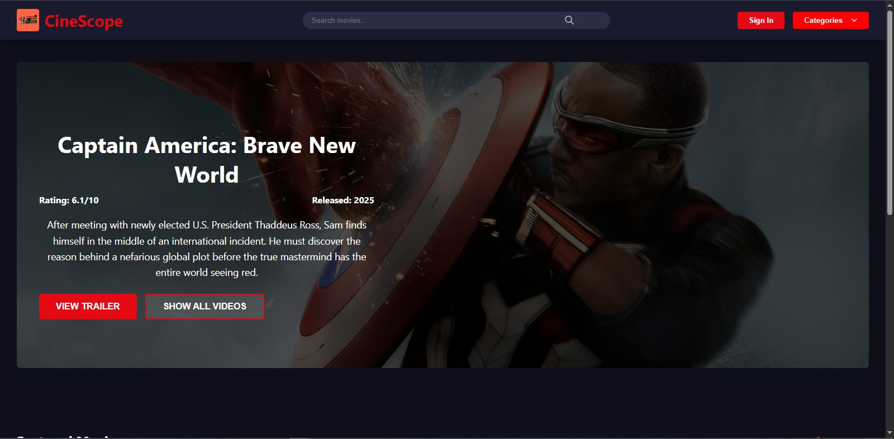

# 🎥 CineScope Movie Streaming Platform

CineScope is a modern movie streaming platform designed to provide users with a seamless experience for discovering, watching, and sharing movies. Built with cutting-edge technologies, CineScope integrates AI-powered recommendations, social watch parties, and adaptive streaming to deliver a premium movie streaming experience.




---

## 🌟 Features
- **Personalized Recommendations:** AI-powered movie suggestions tailored to your preferences.
- **Social Watch Parties:** Watch movies with friends remotely.
- **Adaptive Streaming:** High-quality video playback with adaptive bitrate streaming.
- **User-Friendly Interface:** Intuitive design for easy navigation and discovery.
- **Secure Authentication:** Login with JWT or OAuth (Google/Facebook).

---

## 🚀 Deployment

**Live Demo:** [CineScope Platform](https://cinescope-frontend-y9ee.onrender.com/)

---

## Table of Contents
- [Project Overview](#project-overview)
- [Architecture](#architecture)
- [APIs and Methods](#-apis-and-methods)
- [Data Model](#data-model)
- [User Stories](#user-stories)
- [Mockups](#-mockups)
- [Team Work Division](#team-work-division)
- [Admin Dashboard Features](#admin-dashboard-features)
- [Tech Stack](#-tech-stack)
- [Database Schema](#-database-schema)
- [How to Run](#how-to-run)
- [License](#license)

---

## Project Overview

## 📅 Project Timeline

**Start Date:** April 7, 2025  
**End Date:** April 18, 2025


## 👥 Contributors

| Name          | Role                     |
|---------------|--------------------------|
| **Khulekani mtshali** | Frontend Lead            |
| **Matimu Baloyi**    | Backend Lead, DevOps     |
| **Luyanda Xhakaza**   | Database Architect       |
| **Arise Rifuwo Dzamukeri**     | QA Lead, UI/UX Designer  |
| **Dembe Makhari**     | UI/UX Designer           |
| **Masingita Otis Maluleke** | Fullstack Developer      |

---

## Architecture

### End-to-End Data Flow Diagram
The platform is designed with a modular architecture to ensure scalability and maintainability.

### Components
- **Frontend:** React/Next.js (Landing Page, User Dashboard, Movie Details, Login/Signup page)
- **API Gateway:** Express.js (Routes for authentication, content, recommendations)
- **Backend Services:**
  - Authentication (JWT/OAuth)
  - Content Management (TMDb API integration)
  - Recommendation Engine (TensorFlow.js)
  - Streaming Service (FFmpeg + CDN)
- **Database:** PostgreSQL (Users, Content, WatchParties)
- **External APIs:** TMDb (movie metadata), Google/Facebook OAuth

---

## 📚 APIs and Methods

### Internal APIs
| Endpoint         | Method | Description                                   |
|------------------|--------|-----------------------------------------------|
| `/api/auth`      | POST   | User login/registration (JWT/OAuth)          |
| `/api/movies`    | GET    | Fetch movie catalog (filter by genre/rating) |
| `/api/watchlist` | POST   | Add/remove movie to user’s watchlist         |
| `/api/recommend` | GET    | Fetch AI-powered recommendations             |
| `/api/watchparty`| POST   | Create/schedule a watch party                |

### Third-Party APIs
- **TMDb API:** Fetch movie metadata and search movies.
- **Google OAuth:** Authenticate users via Google accounts.

---

## Data Model

### Key Tables
- **Users:** `user_id`, `email`, `subscription_tier`, `watch_history`
- **Content:** `content_id`, `title`, `stream_url`, `genre`
- **UserContent:** `user_id`, `content_id`, `watch_status`
- **WatchParties:** `party_id`, `scheduled_time`, `participants`

---

## User Stories

1. **Guest User:**  
   As a guest user, I want to browse trending movies without logging in so I can decide if I want to sign up.

2. **Registered User:**  
   As a registered user, I want personalized recommendations based on my watch history so I can discover new movies.

3. **Admin:**  
   As an admin, I want to add/remove movies from the catalog via a dashboard so I can manage content efficiently.

4. **User:**  
   As a user, I want to create watch parties with friends so we can watch movies together remotely.

---

## 🖼️ Mockups

### Landing Page
- Featured movie carousel
- Genre filters
- Login/Signup CTAs

### Movie Details Page
- Trailer preview
- Cast info
- Watch party button
- Recommendations

### User Dashboard
- "Continue Watching" section
- Watchlist
- AI recommendations

---

## Team Work Division

| Role              | Tasks                                    |
|-------------------|------------------------------------------|
| **Frontend Lead** | React components, Redux state management |
| **Backend Lead**  | API development, TMDb integration        |
| **Database Architect** | MongoDB schema design, TypeORM setup     |
| **DevOps Engineer** | CI/CD pipeline, AWS deployment           |
| **QA Lead**       | Manual testing, bug tracking             |
| **UI/UX Designer**| Mockups, styled components               |

---

## Admin Dashboard Features

- **Role-Based Access Control:** Manage permissions for different roles.
- **Content Management:** Add/remove movies, manage categories.
- **User Management:** View and modify user accounts, handle subscriptions.
- **Analytics Dashboard:** Monitor content performance and user engagement.
- **System Health Monitoring:** Track API and server performance.

---

## 🛠️ Tech Stack

### Frontend
- **Framework:** React with Next.js
- **State Management:** Redux
- **Styling:** Styled Components

### Backend
- **Framework:** Node.js with Express.js
- **Authentication:** JWT + OAuth (Google/Facebook)
- **AI Recommendations:** TensorFlow.js
- **Streaming:** FFmpeg with CDN integration

### Database
- **Database:** MongoDB
- **ORM:** TypeORM

---

## 📊 Database Schema

### Users
- `user_id` (PK)
- `email`, `password_hash`, `auth_provider`
- `created_at`, `last_login`

### Content
- `content_id` (PK)
- `title`, `description`, `release_date`
- `poster_image`, `backdrop_image`
- `runtime`, `age_rating`
- `stream_url`, `trailer_url`
- `average_rating`

### WatchParties
- `party_id` (PK)
- `host_user_id` (FK)
- `content_id` (FK)
- `scheduled_time`
- `party_status`
- `invited_users`

---

## 🛠️ How to Run

### Backend
1. Navigate to the backend directory:
   ```bash
   cd cinescope-backend
   ```
2. Install dependencies:
   ```bash
   npm install
   ```
3. Start the server:
   ```bash
   npm start
   ```

### Frontend
1. Navigate to the frontend directory:
   ```bash
   cd cinescope-frontend
   ```
2. Install dependencies:
   ```bash
   npm install
   ```
3. Start the development server:
   ```bash
   npm start
   ```

---

## License

This project is licensed under the [MIT License](LICENSE).
```
